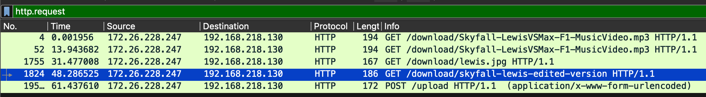
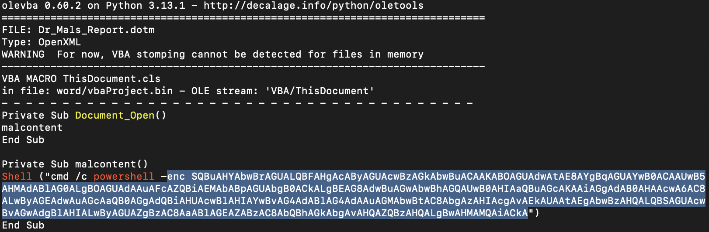
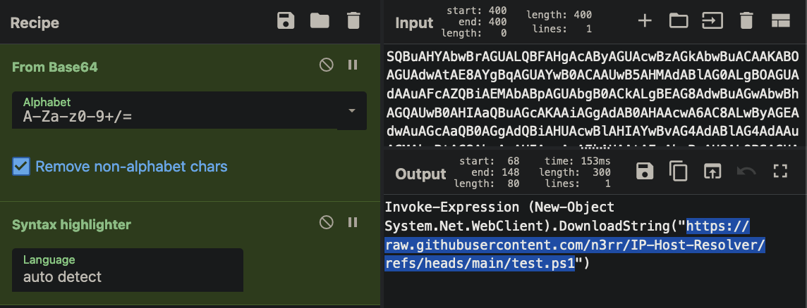

# Cyber Skills Level Up @ UPM

This was my first time attending a cybersecurity workshop.

qs220a, wx_11, and I took a 5-hour bus ride from Johor to Serdang, Selangor at UPM, just for this workshop.

During the workshop, there was a CTF event. I nearly solved the final forensic challenge, but unfortunately, I got stuck on the very last step. Despite that, we still managed to place in the top 6! :P

The writeup will be in order from hardest to easiest.

---

# Skyfall

Description

1. Type: #forensic
2. Desc: I don't know how much Adele loves the Skyfall x Lewis Hamilton edit. She downloaded something about it from a Lewis Hamilton fan website. Now, Adele has lost the flag for this challenge...
3. Tools:
   - Wireshark
   - [pyintstractor](https://pyinstxtractor-web.netlify.app/)
   - [pylingual](https://pylingual.io/)
   - cyberchef
4. File:
   `pcap` and `encrypted_flag.txt`

Flag: ||CSLU{capturing_exfiltrat3d_f1l3}||

---

How to Solve:

- The key detail is that **she downloaded something**, and we were provided with a pcap file. Using Wireshark, we filtered `http.request` and found that she downloaded the following files:


- Notice how the file seems suspicious? We can recover it using `pyinstractor` to convert it into a `.pyc` file, and then use `pylingual` to decompile it back into Python code.
- After obtaining the Python code and reading it, I discovered that the flag was being encrypted using AES encryption with a timestamp.
- Did you notice the timestamp from Wireshark when the file was downloaded? Convert that timestamp into **epoch** format using an online converter. The final step involves some **trial and error**.
- Once we have the key, we can use CyberChef to decrypt the flag.

---

# Dr Mal

Description

1. Type: #misc
2. Desc: donno why Dr. Mal write his report in Lorem Ipsum kinda language
3. Tools:
   - olevba
   - cyberchef
4. File:
   `dotm`

Flag: ||CSLU{now_you_kn0w_h0w_maldoc_workzz555z}||

---

- Use `olevba` to scan the `dotm` file and found a weird text.



- after decrypting it using cyberchef



- it's a powershell script, but when you go to the github link:

```powershell
$flag = 67, 83, 76, 85, 123, 110, 111, 119, 95, 121, 111, 117, 95, 107, 110, 48, 119, 95, 104, 48, 119, 95, 109, 97, 108, 100, 111, 99, 95, 119, 111, 114, 107, 122, 122, 53, 53, 53, 122, 125
$msg = 65, 100, 100, 45, 84, 121, 112, 101, 32, 45, 65, 115, 115, 101, 109, 98, 108, 121, 78, 97, 109, 101, 32, 39, 83, 121, 115, 116, 101, 109, 46, 87, 105, 110, 100, 111, 119, 115, 46, 70, 111, 114, 109, 115, 39, 10, 91, 83, 121, 115, 116, 101, 109, 46, 87, 105, 110, 100, 111, 119, 115, 46, 70, 111, 114, 109, 115, 46, 77, 101, 115, 115, 97, 103, 101, 66, 111, 120, 93, 58, 58, 83, 104, 111, 119, 40, 34, 89, 111, 117, 39, 118, 101, 32, 98, 101, 101, 110, 32, 104, 97, 99, 107, 101, 100, 46, 32, 68, 111, 110, 39, 116, 32, 114, 117, 110, 32, 109, 97, 108, 100, 111, 99, 33, 34, 41

$combinedString = -join ($msg | ForEach-Object { [char]$_ })

Invoke-Expression $combinedString
```

Just decrypt the `$flag` using dcode from ascii

---

# Babysqli

Description

1. Type: #web
2. Desc: -
3. Tools:
   - [sqli cheatsheet](https://www.invicti.com/blog/web-security/sql-injection-cheat-sheet/)
4. File:
   `source file`

Flag: -

---

- Just type `'-'` for admin and password.

---

# Access log

Description

1. Type: #web
2. Desc: -
3. Tools: -
4. File:
   `access.log`

Flag: CSLU{this_is_the_flag_for_th15_challeng3}

---

- When scrolling through the logs, I found out that most of it were 404, or error, so I tried to search for 200 only and i got this sus link.

```zsh
172.26.228.247 - - [08/Nov/2024:21:46:13 +0800] "GET /pastebin.com/us5L3fRp HTTP/1.1" 200 437 "-" "gobuster/3.6"
```

- The `pastebin` will lead you directly to the flag.
