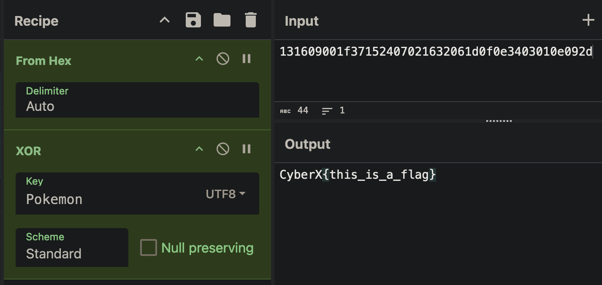

# CyberX CTF


- Can't believe we won Champion for our first CTF tournament!

- My writeups for the cryptography CTFs.

---

## Math?

We are given

```python
n = {LARGE_VALUE}
e1 = {LARGE_VALUE}
e2 = {LARGE_VALUE}
c1 = {LARGE_VALUE}
c2 = {LARGE_VALUE}
```

and equations in `png`:


This can actually be solved in 3 lines lol (or even less XD)

```python
q = math.gcd(n, pow(c1, e2, n) * pow(5, e1 * e2, n) - pow(c2, e1, n) )
q // 16
p = n // q
```

---

Remember to check the values:

```python
if p * q == n:
    print("yes")
else:
    print("no")
```

---

Here's the full code: [math.py](https://github.com/Exberg/ctf-writeups/blob/main/math.py)

---

For those who are actually curious on `how I solved it?`

- I think we need to change the math equation into **simpler** and more **efficient**.
- So, I just follow the reference I found online, and try to modify the equations into more efficient ones.


---

References:

1. https://ctftime.org/writeup/15438
2. https://crypto.stackexchange.com/questions/106396/solve-congruent-equation-likes-n-pq-c1-2p-3qe1-mod-n-c2-5p-7

---

## XOR II

I found an article of XOR Crypto: [link](https://golamrabbany.medium.com/crypto-ctf-you-either-know-xor-you-dont-69ac9b8f4812)

Here's how XOR worked:

When you construct a XOR cipher, you need to enter 2 values: the `key` and the `flag`


---

We don't know the key, but we know the `flag` starts with `"CyberX{"`

`flag` can be used as a key too to

note: `"CyberX{"` consists of **7 letters**, the output will also be **7 letters**.


---

So we use the output `"Pokemon"` as the key



Bingo!

---

## ChessMaster

This one is a bit tough since I have little knowledge in chess.

We are given a `python code`, and `18 chessmoves images`


---

The `python code` looks like cryptography decryption with chessmoves!

```python
import random

mapping = [
    'A', 'B', 'C', 'D', 'E', 'F', 'G', 'H',
    'I', 'J', 'K', 'L', 'M', 'N', 'O', 'P',
    'Q', 'R', 'S', 'T', 'U', 'V', 'W', 'X',
    'Y', 'Z', 'a', 'b', 'c', 'd', 'e', 'f',
    'g', 'h', 'i', 'j', 'k', 'l', 'm', 'n',
    'o', 'p', 'q', 'r', 's', 't', 'u', 'v',
    'w', 'x', 'y', 'z', '1', '2', '3', '4',
    '5', '6', '7', '8', '9', '0', '{', '}'
]

# Create a scrambled version of the mapping
scrambled_mapping = mapping.copy()
random.seed(12423915)
random.shuffle(scrambled_mapping)

def encrypt(flag):
    value = []
    for i in range(len(flag)):
        z = scrambled_mapping.index(flag[i])  # Find the index in scrambled mapping
        chars = "abcdefgh"

        filemodulus = (z % 8)  # Calculate the "file" (a-h)
        file = chars[filemodulus]

        rank = int(z / 8) + 1  # Calculate the "rank" (1-8)

        value.append(''.join(f'{file}{rank}'))
    return value

def decrypt(encrypted_values):
    chars = "abcdefgh"
    decrypted_message = []

    for value in encrypted_values:
        file = value[0]  # Extract the file (a-h)
        rank = int(value[1])  # Extract the rank (1-8)

        # Find the index corresponding to the file
        filemodulus = chars.index(file)

        # Calculate the original index of the scrambled_mapping
        z = (rank - 1) * 8 + filemodulus
        decrypted_message.append(scrambled_mapping[z])

    return ''.join(decrypted_message)

# Example encrypted chess positions (this should match the output of `encrypt` function)
encrypted_values = ['']

# Decrypt the message
decrypted_message = decrypt(encrypted_values)
print("Decrypted:", decrypted_message)

# Example encryption of a message
message = "ILOVEUTM"
try:
    encrypted_message = encrypt(message)
    print("Encrypted:", encrypted_message)
except:
    print("Error: Message contains characters not in the mapping.")

```

---

We just need to figure out what is the **encrypted values**

```python
encrypted_values = ['?'] # ?????
```

When you look at the chessmoves images, you will see they can all be solved with just 1 move **checkmate**.


---

Now write all the values in their respective chess positions

```python
encrypted_values = ['g5', 'h2', 'h5', 'd2', 'd1','g3','d7', 'a5', 'e5', 'e3', 'd2', 'b5', 'a6', 'a7', 'd1', 'g4', 'f2', 'c6']
```

There is also some tricky in the last image (the white and black position were swapped):


---

Finally, run the Code and Voila!


---

## APT APT APT APT

This challenge is actually very easy but just annoying.


First, it looks like a cipher. So, I just went to decode.fr to search for music related cipher:


I ciphered everything just in case lol (pain)

---

## Simon & Bob
