# EQCTF

- This [CTF](https://eqctf.com/scoreboard) is organized by fellow Malaysians.
- I love every OSINT challenges, I even managed to get one first blood!.
- Brainfuck challenges are cursed.
- I got lucky spot top ten!

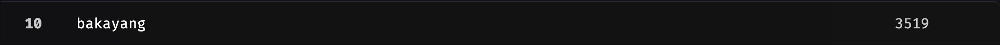

- Will work on every challenges for web and crypto! Stay tuned!

---

# OSINT

## Lost At Sea

- You are given an image and need to find its **exact coordinates**.

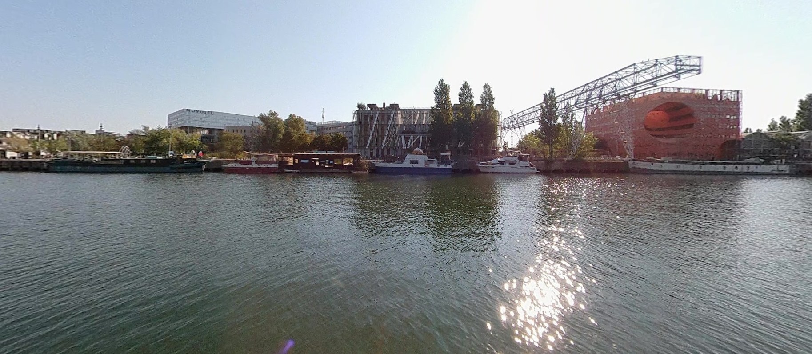

---

- At first I search for the `NOVOTEL`, and reverse search the cropped image of the hotel.
  

---

- I found the location at `lyon, france` and tried every possible attempts from the angle (street view) ... none of them works, I even tried changing different time.

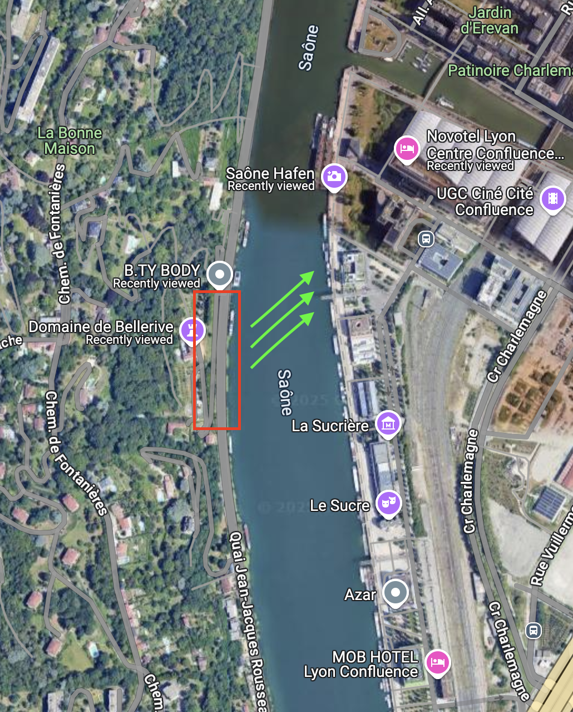

---

- Then, after multiple attempts, I click at the `river` and open the `street view`.

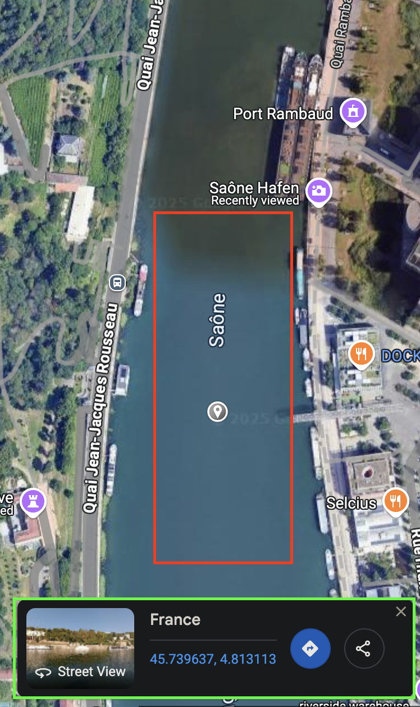

---

- After `analyze and compare` the `image and street view`, I found out they are the same, the exact coords is at the `link url in red`.

---

## Garry: Beyond Music's End 3

Desc: Garry and his friends seem to be talking about a new threat group that steals wizard data, wonder what the fuzz is all about...

---

- This one need to find the `github repo` since they mentioned `repo`.

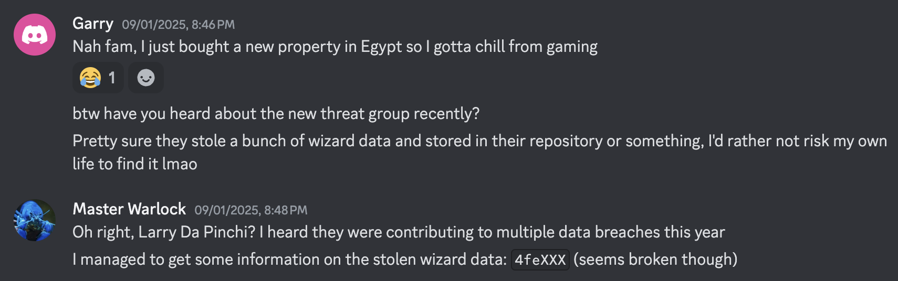

---

- After looking through the files, I found out they prob removed it. But, you can still find it via `Activity`

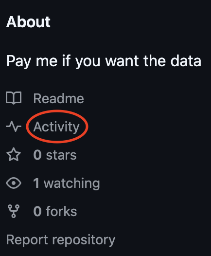

---

- Bingo!

 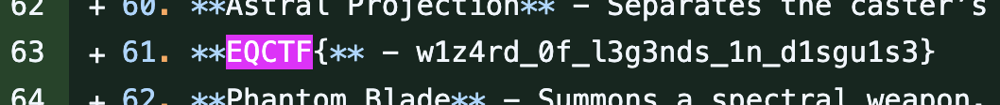
 
---
## Garry: Beyond Music's End 4

Desc: Garry made a new post, I heard he is gonna be a Supreme Wizard today!

---

- In `Garry's x.com` from `Garry: Beyond Music's End 1`, the image description in the gif contains a `link`.

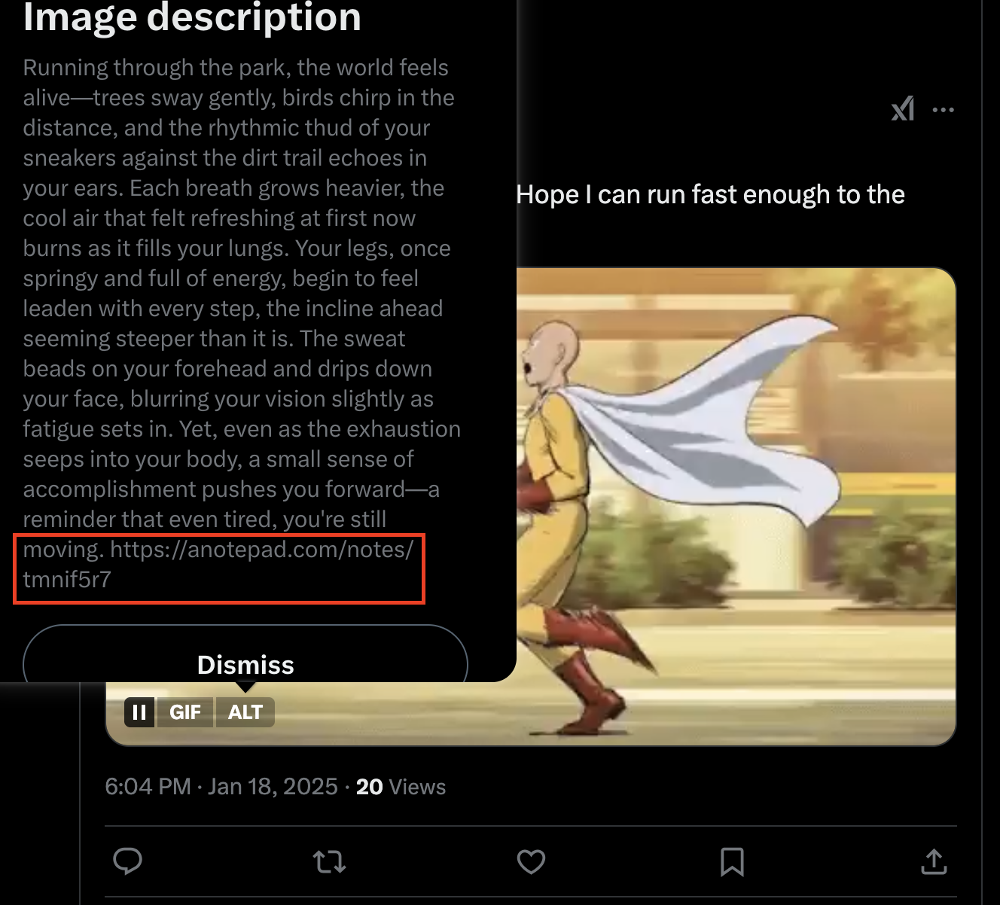

---

- The `link` navigates to a `brainfuck code`.
  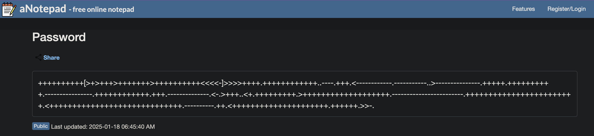

---

- Decrypting `brainfuck code` gets you a `discord link`.
  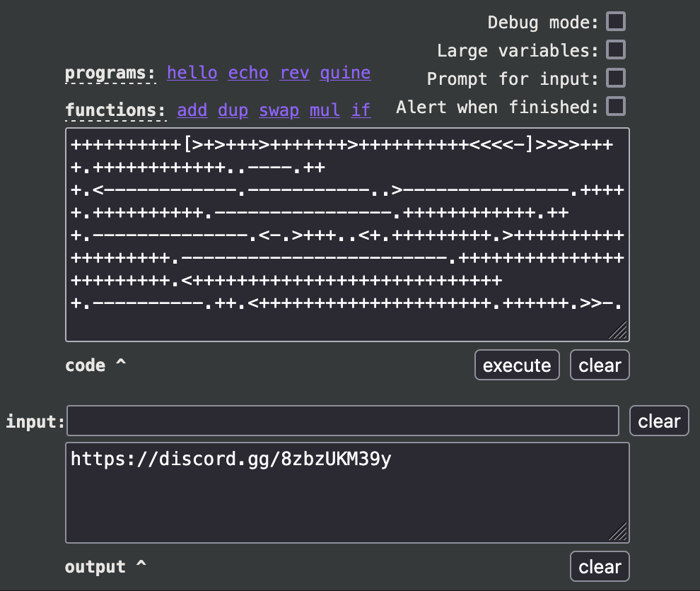

---

- Inside `discord link`, got `plus code`.
  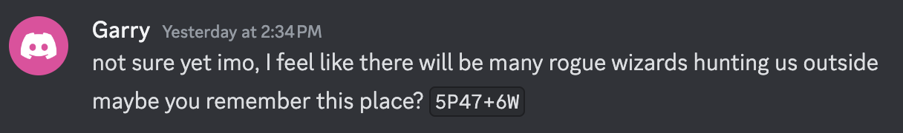

---

- After research `plus code`, it gets to the `location`.
  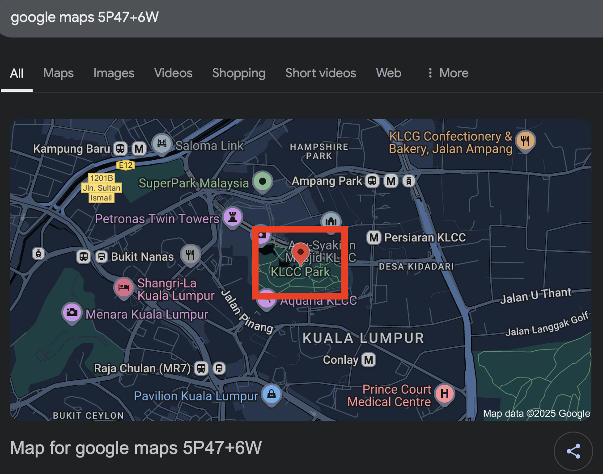

# BRAINFUCK

## DETERMINATION

- Whoever made this challenge, I'll send assassins to u. JK... JK...
- This challenge is so cooked...

---

- First, I use `premiere pro` to `0.25x speed`.
- and yes, I watched every frames 😭
- The challenge is to `spot the flag` `hidden sight` in the video.
- You get the flag in `3 parts`.
- The first one ||look bottom left corner||
  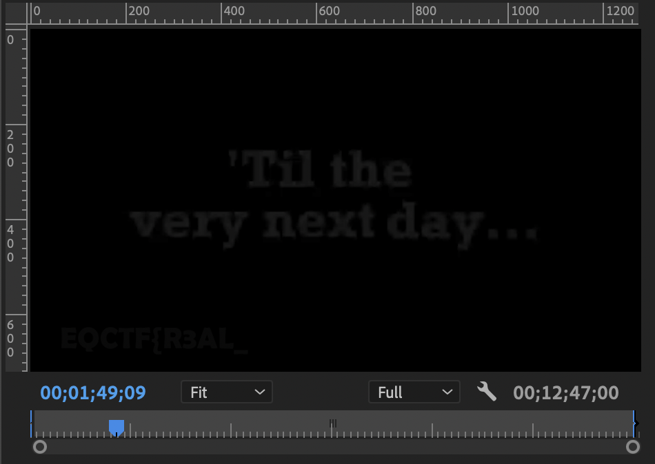
- The second one ||left besides tree in white dream||
  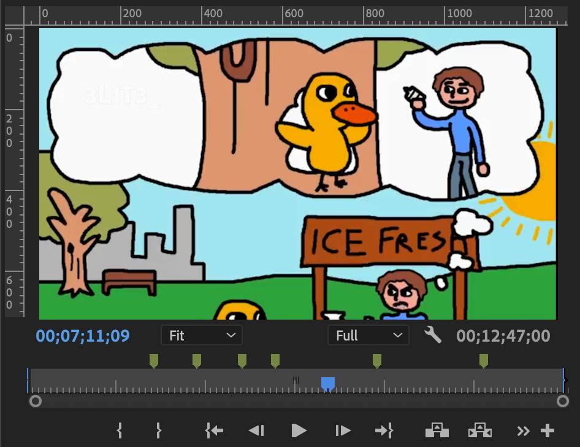
- The third one ||look under the window||
  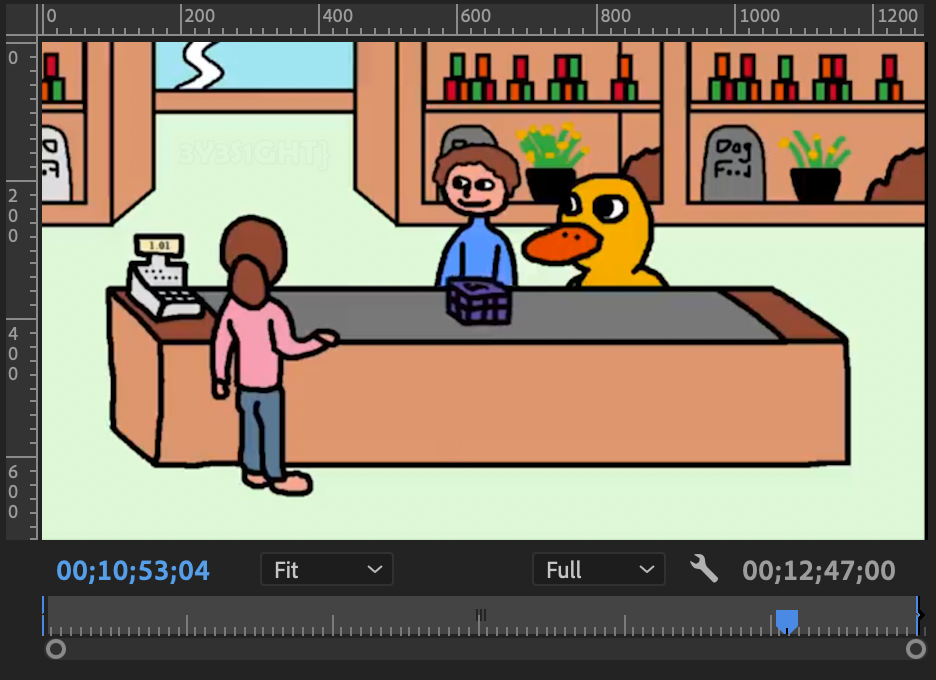
- The flag (for those who don't want to cooked): ||EQCTF{R3AL_3L1T3_3Y3S1GHT}||

---
