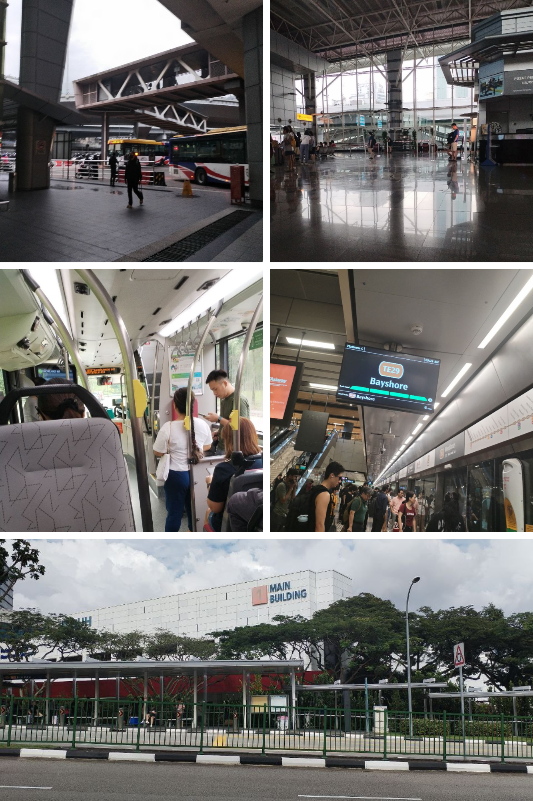
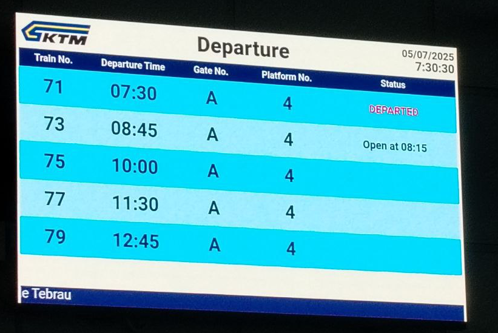
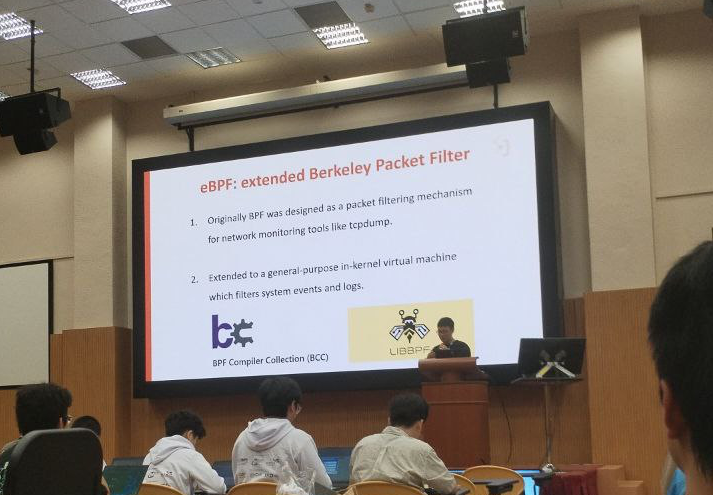
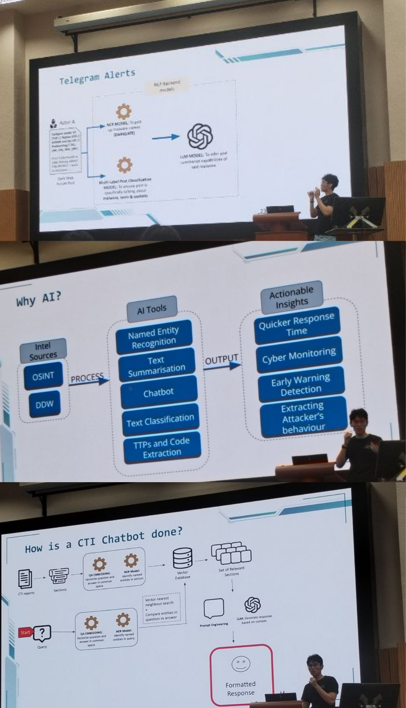
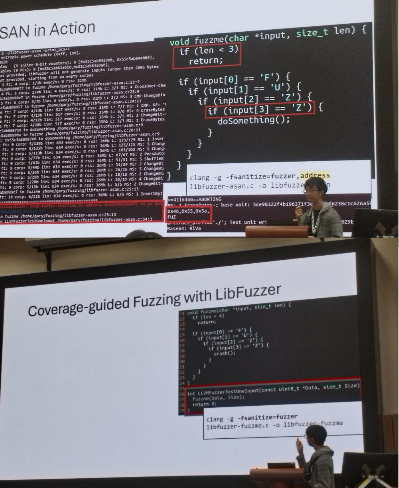
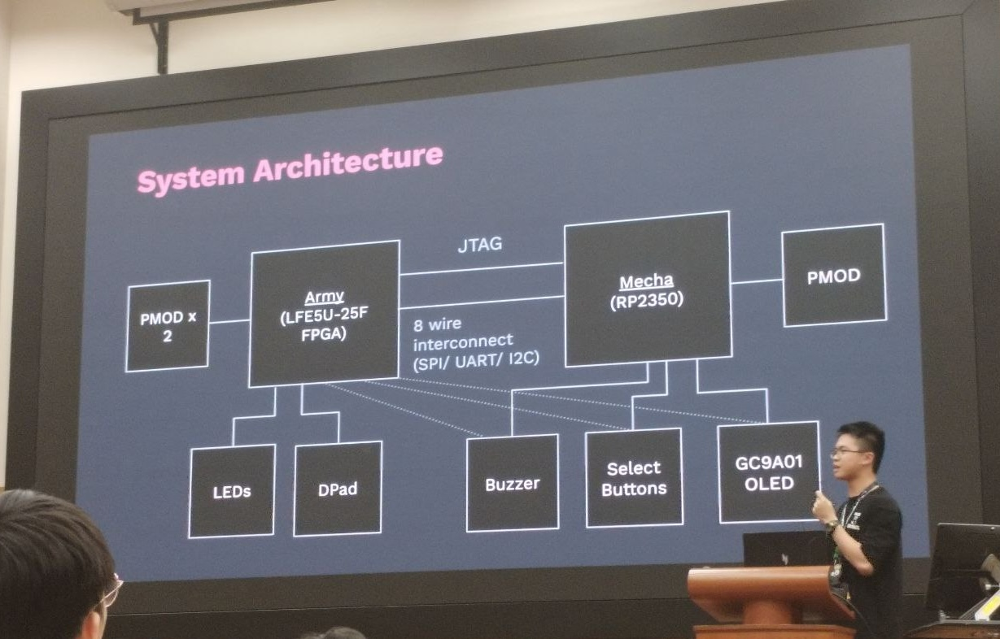
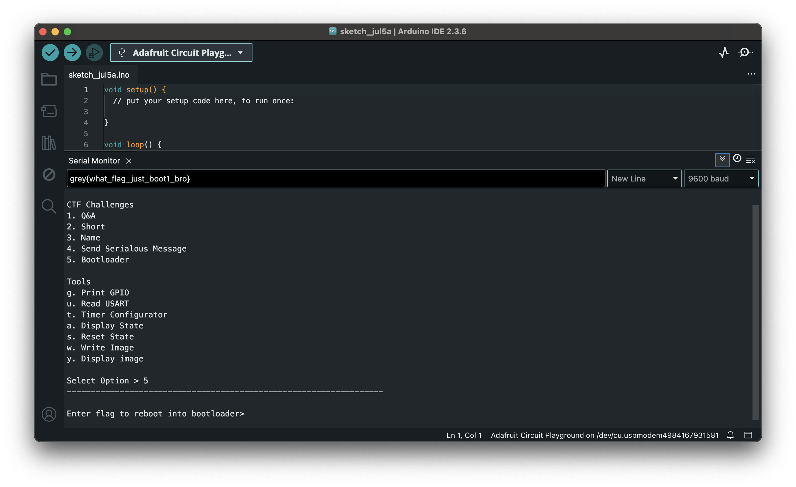
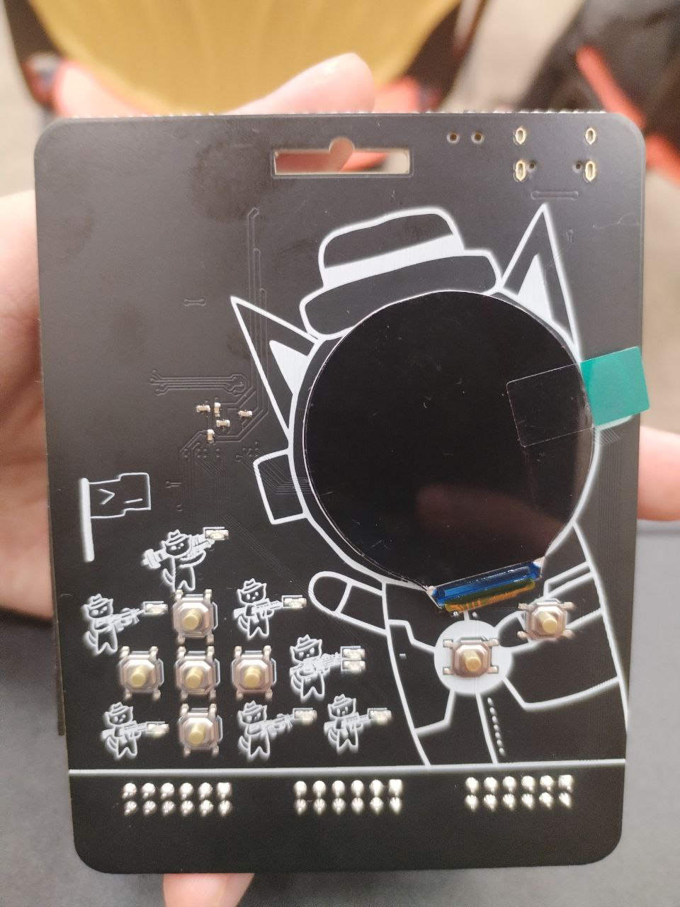
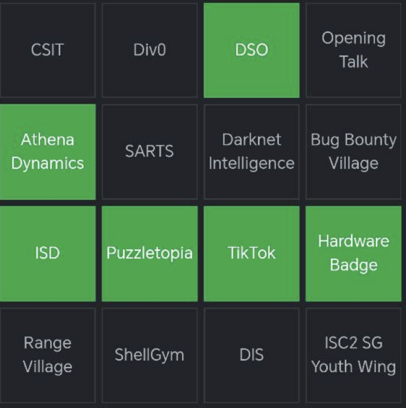

# My Journey to GreyCTF Summit 2025

The journey to the summit was an adventure in itself! Here's how I got there:

1.  **P211 Bus** to Larkin Sentral
2.  **P201 Bus** to JB Sentral
3.  **Train** to Woodlands CIQ, Singapore
4.  **Bus** to Woodlands MRT
5.  **SMRT** to Kent Ridge MRT
6.  **NUS Bus** to the School of Computing

---

## A Rough Start

:::caution[Missed Train]
Unfortunately, I missed my train to Singapore. Lesson learned: **always arrive at least 30 minutes early**.
:::

To make up for it, I decided to take the bus to Woodlands. It was a longer route, but I eventually made it.
RIP my wallet...

---

# Sessions

| Time          	| Session                              	|
|---------------	|--------------------------------------	|
| 1020h - 1230h 	| Workshop: Active Directory           	|
| 1230h - 1400h 	| Lunch & Networking                   	|
| 1400h - 1430h 	| Talk 1: Linux Internal eBPF          	|
| 1430h - 1500h 	| Talk 2: AI in Cybersecurity          	|
| 1500h - 1530h 	| Talk 3: Intro to Fuzzing             	|
| 1530h - 1630h 	| Talk 4: Behind The Scenes of GreyCTF 	|

## Workshop: Active Directory
Presented by RangeVillage, this hands-on workshop covered Active Directory security fundamentals, including enumeration techniques, privilege escalation methods, and attack path discovery. 

We used tools such as:
1. NXC - NetExec - The Network Execution Tool (Enumeration and Execution)
2. Evil WinRM
3. Impacket
4. bloodyAD
5. mimikatz 

During the breaks, I visited sponsor booths and caught several demos, which unfortunately caused me to miss parts of the tutorial. 

**Resources:**
- [Lab Sheet](https://github.com/ASYNC-Security/SINCON2025-Training-Public/blob/main/lab_sheet.md)

---
## Talk 1: Linux Internal eBPF
This one covered about linux internal stuff, cool and didn't know much about.

---
## Talk 2: AI in Cybersecurity
This session covered how large language models gather intelligence from the dark web and index it in a vector database. By querying this database, participants could retrieve up-to-date, filtered information on advanced persistent threats (APTs).

---

## Talk 3: Intro to Fuzzing
I learned that fuzzing is a software testing technique that feeds unexpected or random inputs to an application to uncover bugs and ensure it handles edge cases gracefully without crashing.

They introduced powerful fuzzing tools such as LibFuzzer, which automate test case generation and help uncover edge-case bugs efficiently.

---

## Talk 4: Behind The Scenes of GreyCTF

This session was led by the GreyCTF challenge creators, who walked us through their design process—how they develop challenges, adjust difficulty, and refine problem statements.

They also provided an in-depth overview of the custom badge’s internal architecture and its design considerations:

---

# Hardware Hacking

For me, the highlight of the summit was the hardware hacking booth. I learned so much about working with hardware, and it was incredibly rewarding.

One of the coolest parts was the custom badge they provided. It was built on a **Field-Programmable Gate Array (FPGA)** and could be programmed using **CircuitPython**. This hands-on experience was both fun and educational.

So, first they introduced some quizzes that must be solved before going to the next stage...

After that, the real hacking begins, this is the same challenge used for in the GreyCTF Finals.

*The custom FPGA badge provided to participants.*

---

# Photo Gallery

*Booth Bingo*

*Food by Grain*

*Photos I took in NUS*

