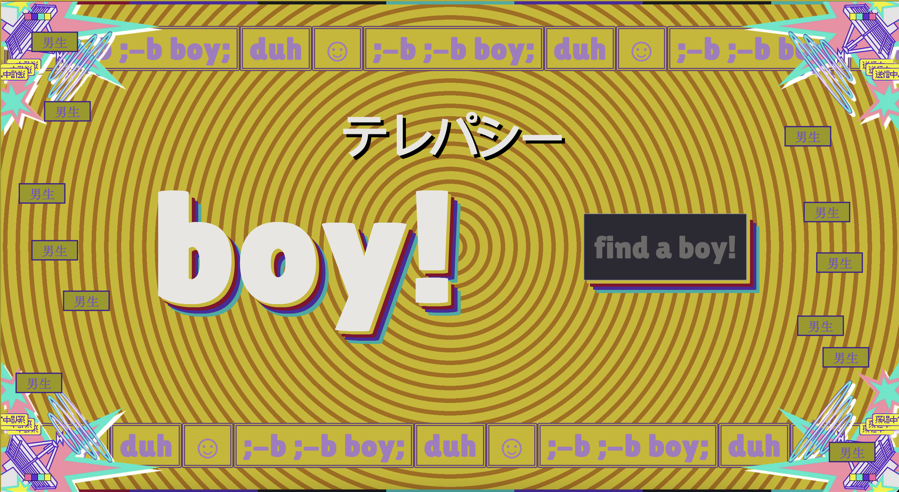

---
# Web 

## Boy!




***TLDR: SQL Injection***

### Code Review
Key portions of the Flask application:
```python
def search(boy):
    # Build a blacklist generator (non-letter characters)
    blacklist = (c for c in printable if c not in "ABCDEFGHIJKLMNOPQRSTUVWXYZabcdefghijklmnopqrstuvwxyz")

    # Prevent direct flag references
    if 'flag' in boy:
        return "nope!"

    # Filter out blacklisted characters
    filtered = ''.join(ch for ch in boy if ch not in blacklist)

    # Vulnerable query construction
    query = f"SELECT duhhh FROM duh WHERE boy = '{filtered}'"
    cursor.execute(query)
    ...
```

### Vulnerability
- The `filtered` input is interpolated directly into the SQL string.
- Only non-letter characters are filtered; single quotes (`'`) remain, so the attacker can terminate the string literal.

### Exploitation Steps
1. **String termination**: Use a single quote (`'`) to close the `boy` string literal.
2. **UNION injection**: Append `UNION SELECT substr(FLAGtext,2,100) FROM FLAG` to extract the flag.
3. **Comment out** the rest of the query with `--`.

Final payload:
```
X' UNION SELECT substr(FLAGtext,2,100) FROM FLAG--
```

### Payload Explanation
- `X'`: Closes the original `WHERE boy = 'X'` string.
- `UNION SELECT ...`: Combines results from the `flag` table.
- `substr(FLAGtext,2,100)`: Skips the first character to bypass an initial filter or formatting.
- `--`: Comments out any trailing SQL.

### Flag


After submitting the payload, the application returns:
```
SSMCTF{b-b-bb-b-oy:::;bob-b-oy;;duh!duh!duh!duh!}
```
---

## Stealing Treasure


### Challenge Description
This endpoint allows authenticated users to update their own account fields via the `/password` form and access protected treasure resources. However, it fails to restrict which columns can be modified, enabling privilege escalation.

### Code Review
```python
def auth():
    token = request.cookies.get('token')
    if token:
        decoded = jwt.decode(token, app.config['SECRET_KEY'], algorithms=['HS256'])
        return decoded['id'], decoded['admin']
    return -1, 0

@app.route('/password', methods=['GET', 'POST'])
def password():
    if request.method == 'POST':
        id, admin = auth()
        updates = [[k, request.form.get(k)] for k in request.form]
        # Dynamically update any column present in form data
        for field, val in updates:
            cols = [col[1] for col in sqlite3.connect('treasure.db')
                    .execute('PRAGMA table_info(users)').fetchall()]
            if field in cols:
                # No restriction on 'admin' field
                sqlite3.connect('treasure.db')
                    .execute(f"UPDATE users SET {field} = ? WHERE id = ?", (val, id))
                sqlite3.connect('treasure.db').commit()
        return jsonify({'status': 'success'})
```

### Vulnerability
- The `password` route builds its SQL update statement dynamically from form keys without banning sensitive columns.
- Attackers can inject `admin=1` in the form data to grant themselves admin privileges.

### Exploitation Steps
1. Authenticate as a regular user (admin = 0) and obtain the `token` cookie.  
2. Send a POST request to `/password` with form data:
   ```
   password=yourCurrentPassword
   admin=1
   ```
   This sets your `admin` column to 1 in the database.  
3. Visit `/logout` to clear the old token cookie.  
4. Log in again with your credentials to receive a new JWT containing `"admin":1`.  
5. Access the `/steal` endpoint using your token cookie:
   ```shell
   curl -b "token=<your_jwt_cookie>" https://<host>/steal
   ```
   The server responds with stolen treasure.  
6. Browse to `/treasure` to view the stolen items and the flag.

### Flag


```
SSMCTF{Br0ken_acc33ss_c0ntr0l_succ44ssful_aad01750ee1b}
```

---

# Crypto

## Cauldron


:::note
This challenge applies a combination of three transformations—Caesar shift (C), Base64 encoding (B), reversal (R), character-pair substitution (S), XOR with 255 (X), and ASCII-based grouping (O)—to a fixed plaintext and the secret flag. By testing all possible compositions on the sample text and finding the matching pattern, we can reverse the same sequence on the encoded flag to recover it.
:::

```python
from secret import flag
# C = Caesar Cipher?
def C(text):
    ...
# B = base64?
def B(text):
    ...
# R = reverse?
def R(text):
    ...
# S= subsitution?
def S(text):
    ...
# X = XOR?
def X(text):
    ...
# O = ascii?
def O(text):
    ...
text = "Double, double, toil and trouble. Fire burn and cauldron bubble!"
functions = [C, B, R, S, X, O]

output = open('output.txt', 'w')

for func1 in functions:
    for func2 in functions:
        for func3 in functions:
            output.write(func1(func2(func3(text))))
            output.write('\n')

for func in functions:
    flag = func(flag)

output.write(flag)
output.close       
```

### Determining the Sequence
By enumerating all 6×6×6 = 216 function combinations
We can get the list of functions combinations with the correct order.
Therefore we can just guess each functions individually.

```python
# Print all possible combinations of function names
functions = ['C', 'B', 'R', 'S', 'X', 'O']

# Keep track of how many combinations we've printed
count = 0

for func1 in functions:
    for func2 in functions:
        for func3 in functions:
            # Print the function composition
            print(f"{count+1}: {func1}({func2}({func3}(text)))")
            count += 1

print(f"\nTotal combinations: {count}")
```

We implement each reversal to invert the transformations:

I initially identified 'B' as Base64 encoding based on the function names provided for each line. This allowed me to correctly deduce the function 'A' in sequence 'BBA' without needing to test other functions. Using a similar approach, I systematically deduced the transformations for all other functions as well.

Lastly the solution script:
```python
def reverse_O(data):
    # Split by "!"
    tokens = data.split("!")
    
    result = ""
    
    for token in tokens:
        # Skip empty tokens
        if not token:
            continue
            
        # Remove any leading space
        token = token.strip()
        if not token:
            continue
            
        # Group characters into sets of 3
        groups = [token[i:i+3] for i in range(0, len(token), 3)]
        
        # Extract middle character from each complete group
        for group in groups:
            if len(group) == 3:  # Only process complete groups
                result += group[1]
    
    # Add "!" at the end if the original string ends with "!"
    if data.endswith("!"):
        result += "!"
    
    return result

def reverse_X(data):
    # X is XOR with key 255
    key = 255
    result = ''
    
    # Input is comma-separated decimals
    numbers = [int(x) for x in data.split(',')]
    
    for number in numbers:
        result += chr(number ^ key)
    return result

def reverse_S(data):
    # S swaps adjacent character pairs
    result = ''
    i = 0
    while i < len(data):
        if i+1 < len(data):
            # Swap each pair of characters
            result += data[i+1] + data[i]
            i += 2
        else:
            # Handle odd length
            result += data[i]
            i += 1
    return result

def reverse_R(data):
    return data[::-1]
def reverse_B(data):
    import base64
    try:
        # Add padding if needed
        missing_padding = len(data) % 4
        if missing_padding:
            data += '=' * (4 - missing_padding)
        return base64.b64decode(data).decode('utf-8')
    except:
        # If base64 decoding fails, return original
        return data
def reverse_C(data):
    return ''.join(chr(ord(c) - 7) for c in data)
def decode_flag(encoded_flag):
    # Apply reverse functions in reverse order
    data = encoded_flag
    data = reverse_O(data)
    data = reverse_X(data)
    data = reverse_S(data)
    data = reverse_R(data) 
    data = reverse_B(data) 
    data = reverse_C(data) 
    return data

# The encoded flag
encoded_flag = "012678345+,-01289:345+,-012234567+,-012345345+,-01256789:+,-012345012+,-012456234+,-012789234+,-012345789+,-123/01345+,-012456789+,-012789234+,-123/01567+,-012345567+,-012456567+,-123/01456+,-012345345+,-123/01012+,-012456345+,-012567678+,-012456456+,-01289:89:+,-012456123+,-012789678+,-012456678+,-012789789+,-012456456+,-012567789+,-012234456+,-012567456+,-012456345+,-123/01345+,-012234456+,-012345567+,-012678678+,-123/01345+,-012789/01+,-01289:/01+,-012567456+,-012345/01+,-01256789:+,-012345012+,-012678567+,-123/01345+,-01278989:+,-012345567+,-012234567+,-012345345+,-012789123+,-123/01012+,-012678678+,-123/01345+,-012567456+,-123/01345+,-012456123+,-012789345+,-012345012+,-012789789+,-012456567+,-01234589:+,-01289:89:+,-123/01345+,-012567456+,-012345567+,-01289:89:+,-123/01012+,-012456345+,-123/01456+,-012456456+,-012345567+,-012678123+,-012234234+,-012234456+,-012345567+,-012678678+,-123/01567+,-012789012+,-012456123+,-012234567+,-012345345+,-01223489:+,-012678678+,-012678123+,-012345678+,-012345234+,-012678/01+,-012567789+,-012345678"

# Decode and print the flag
flag = decode_flag(encoded_flag)
print(flag)
```

### Flag
`SSMCTF{Y0U_D0_th3_h0k3y_p0k3y_4nd_y0u_tuRn_y0urs3lf_ar0und}`

---

## Tariff Evaluation


This challenge is a RSA but with `p-leak` as a hint:
```python
gap.eval('LoadPackage("ctbllib")')
q = PowerSeriesRing(QQ, 'q').gen()
GLOBAL_1 = factorial(10000)
GLOBAL_2 = 0.00001
leak = ((lambda VAR_1: nplog(VAR_1) - VAR_1/(len([VAR_2 for VAR_2 in range(2, VAR_1) if ( lambda VAR_1: all([VAR_1 % VAR_2 for VAR_2 in range(2, VAR_1)]))(VAR_2)])))(GLOBAL_1)) * ((round((1728 * ((4/3) * (1 + 240 * sum([(lambda VAR_1, VAR_2: sum([VAR_3**VAR_1 for VAR_3 in divisors(VAR_2)]))(3, n) * q**n for n in range(1, 5)])))**3 / (((4/3) * (1 + 240 * sum([(lambda VAR_1, VAR_2: sum([VAR_3**VAR_1 for VAR_3 in divisors(VAR_2)]))(3, n) * q**n for n in range(1, 5)])))**3 - 27*((8/27) * (1 - 504 * sum([(lambda VAR_1, VAR_2: sum([VAR_3**VAR_1 for VAR_3 in divisors(VAR_2)]))(5, n) * q**n for n in range(1, 5)])))**2).add_bigoh(5)).add_bigoh(5)[1])-ast.literal_eval(gap.eval('List(Irr(CharacterTable("M")), chi -> Degree(chi));'))[1])) * ((lambda VAR_3: lambda VAR_1: sum([(VAR_1**VAR_2) * (VAR_3[VAR_2 % 4] / (lambda VAR_1: VAR_1 * factorial(VAR_1-1) if VAR_1 else 1)(VAR_2)) for VAR_2 in range(GLOBAL_1)]))([0, 1, 0, -1])(1) ** 2 + (lambda VAR_3: lambda VAR_1: sum([(VAR_1**VAR_2) * (VAR_3[VAR_2 % 4] / (lambda VAR_1: VAR_1 * factorial(VAR_1-1) if VAR_1 else 1)(VAR_2)) for VAR_2 in range(GLOBAL_1)]))([1, 0, -1, 0])(1) ** 2) + (lambda FUNC, VAR_1, VAR_2: sum([GLOBAL_2 * FUNC(VAR_3) for VAR_3 in arange(VAR_1, VAR_2, GLOBAL_2)]))((lambda VAR_3: lambda VAR_1: sum([(VAR_1**VAR_2) * (VAR_3[VAR_2 % 4] / (lambda VAR_1: VAR_1 * factorial(VAR_1-1) if VAR_1 else 1)(VAR_2)) for VAR_2 in range(GLOBAL_1)]))([0, 1, 0, -1]), -0.5, 0.5) * ((lambda VAR_1: int(f'0x{md5(b64decode(VAR_1)).hexdigest()}', 16))("YQAAAAAAAAAAAAAAAAAAAAAAAAAAAAAAAAAAAAAAAAAAAAAAAAAAAAAAAAAAAAAAAAAAAAAAAAAAAAAAAAAAAJtT15kGLJVhHSym6g/aYwYYJMzurOZMzzCafGZ3wpH8EuT1veo0GdLnJUYh7YMYccigMh4+nd0w1GMZhFkwPUSzGK9QghJEhBsQ/TAdrz1zrlB2Oxo4oSLdO/TEWBldns0w3uIrGHN1caStr+JhTaqZWpB9u9DZQpUdmHFcIZnf") / (lambda VAR_1: int(f'0x{md5(b64decode(VAR_1)).hexdigest()}', 16))("YQAAAAAAAAAAAAAAAAAAAAAAAAAAAAAAAAAAAAAAAAAAAAAAAAAAAAAAAAAAAAAAAAAAAAAAAAAAAAAAAAAAAJtT15kGLJVhHSym6g/aYwYYJMxurOZMzzCafGZ3wpH8EuT1veo0GdLnJUYh7QMZccigMh4+nd0w1GMZBFkwPUSzGK9QghJEhBsQ/TAdrz1zrlB2uxo4oSLdO/TEWBldns0w3uIrGHN1caStr+LhTKqZWpB9u9DZQpUdmPFcIZnf")) * ((lambda VAR_1: reduce(lambda VAR_2, _: 1 + 1 / VAR_2, range(VAR_1 - 1), 1))(GLOBAL_1) ** 2 - (lambda VAR_1: reduce(lambda VAR_2, _: 1 + 1 / VAR_2, range(VAR_1 - 1), 1))(GLOBAL_1))

pt = bytes_to_long(flag.encode('utf-8'))
p, q = getPrime(1024), getPrime(1024)
n = p * q
ct = pow(pt, 0x10001, n)

print(f'{ct = }')
print(f'{n = }')
print(f'{p - leak = }')
```
Turns out `leak` is actually just a fancy function, the value is `1`

```python
p=
l= #leak
print(p-l)
# 1
```

### Solution script
Therefore we have `p` already by just adding `leak+1`: 

```python
from Crypto.Util.number import *
p = 
n = 
ct = 
q = n//p
assert n == p*q
phi= (p-1)*(q-1)
e= 65537
d = pow(e, -1, phi) 
flag = pow(ct,d,n)
print(long_to_bytes(flag))
```

### Flag
`SSMCTF{This is a great time to get rich, richer than ever before!!! The markets are going to boom, the stock is going to boom!}`

---

