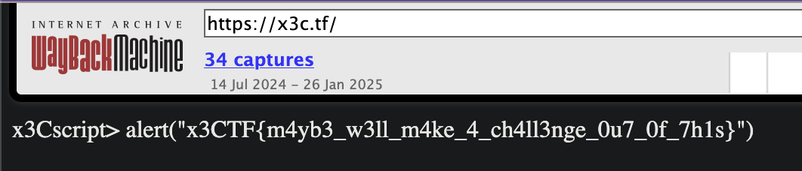

# X3CTF (feat. MVM)

- This is my first time in participating international CTFs
- I got lucky to solve a couple of challenges

---

## Man vs Matrix

Category: #Crypto

Desc: I've just built an RNG algorithm from scratch. Can you break it?

**TL;DR**

- **Linear Functions**: Modeled each sample as a linear equation involving the RNG's matrix entries and states.
- **State Propagation**: Tracked deterministic state updates via exponentiation in `GF(p)` to compute all required states.
- **Matrix Recovery**: Solved the system using SageMath to reverse-engineer the matrix from the samples.
- **Seed Extraction**: Converted matrix entries to 3-byte chunks (big-endian) to reconstruct the seed.

**Final Flag**: ||MVM{l1n34r_fuNcT10n5_4r3_my_f4v}||

**Code**

```python
from sage.all import *
from Crypto.Util.number import long_to_bytes

samples = [6192533, 82371, 86024, 4218430, 12259879, 16442850, 6736271, 7418630, 15483781]

p = next_prime(2**24)
F = GF(p)
gen = F(2)

# Compute all states S0 to S9
states = []
current_state = vector(F, [ord(c) for c in "Mvm"])  # S0
states.append(current_state)
for _ in range(9):
    next_state = vector(F, [gen**int(s) for s in current_state])
    states.append(next_state)
    current_state = next_state

# Prepare the coefficient matrix A and vector b
A = []
b = []
for k in range(9):
    S_prev = states[k]
    S_curr = states[k+1]
    equation = []
    # Expand (M * S_prev) ⋅ S_curr = sum_{i,j} M[i,j] * S_prev[j] * S_curr[i]
    for i in range(3):
        for j in range(3):
            equation.append(S_prev[j] * S_curr[i])
    A.append(equation)
    b.append(samples[k])

# Solve the system A * M_flattened = b
A_matrix = matrix(F, A)
b_vector = vector(F, b)
M_flattened = A_matrix.solve_right(b_vector)

# Reshape the flattened matrix into 3x3
M = matrix(F, 3, 3, M_flattened)

# Extract seed from matrix M
seed_bytes = b""
for element in M.list():
    seed_bytes += int(element).to_bytes(3, 'big')

# Construct the flag
flag = b"MVM{" + seed_bytes + b"}"
print(flag.decode('latin1'))
```

## foundations

Category: #OSINT

Desc: I wonder what the first ever x3CTF flag was...



